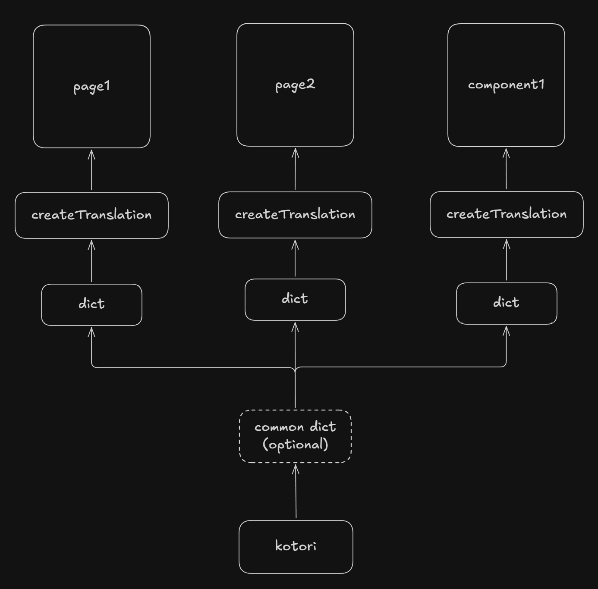

# Kotori

Strongly-typed, modular i18n for React. Variables are inferred directly from your strings — no codegen, no JSON, no schema files.

```ts
const { dict } = kotori({
    primaryLanguageTag: 'en',
    secondaryLanguageTags: ['zh', 'ja', 'ms'],
})

// ❌ TypeScript error: missing japanese translation
const intro = dict({ 
    // ⭐ base string drives the type contract
    en: 'Hello {{name}}, is it {{time}} now?', 
     // ❌ TypeScript error: missing key 'name' 
    zh: '你好，现在是 {{time}} 吗？',
    // ❌ TypeScript error: unknown key 'nam'      
    ms: 'Hai {{nam}}, adakah pukul {{time}} sekarang?'  
// optional: type your arguments, by default it's `Record<'name'|'time', string>` in this example
})<{name: string; time: `${number}:${number}`}> 

// ✅ Works
t('intro', { name: 'John', time: '12:25' }) 
// ❌ TypeScript error: missing { name }
t('intro', { time: '12:25' })
// ❌ TypeScript error: unknown key 'nama'                   
t('intro', { nama: 'John', time: '12:25' }) 
// ❌ TypeScript error: invalid format for 'time'
t('intro', { name: 'John', time: '12-00' }) 
```

- No codegen
- No JSON
- No dependencies
- No build step
- 0.39kb gzipped
- Modular and tree-shakeable
- Language change in one page rerenders all pages
- Translation keys are typed — no more string typos
- Variables typed and inferred from string literals

## Installation

```bash
npm i kotori
```

## Quick Start

**utils.ts**

```ts
import { kotori } from './kotori'

export const { createTranslations, dict } = kotori({
    primaryLanguageTag: 'en',
    secondaryLanguageTags: ['zh', 'ja', 'ms'],
})
```

**page1.tsx**

```tsx
import { createTranslations, dict } from './utils'

const intro = dict({
    en: 'my name is {{name}}, I am {{age}} years old.',
    zh: '我叫{{name}}，我今年{{age}}岁了。',
    ja: '私の名前は{{name}}で、{{age}}歳です。',
    ms: 'nama saya {{name}}, saya berumur {{age}} tahun.',
})

const time = dict({
    en: 'time {{time}}',
    zh: '时间 {{time}}',
    ja: '時間 {{time}}',
    ms: 'waktu {{time}}',
// optional: type your arguments, by default it's `Record<'time', string>` in this example
})<{ time: `${number}:${number}:${number}` }> 

const { useTranslations } = createTranslations({
    intro,
    time,
})


export const Page1 = () => {
    const { t, setLanguage } = useTranslations()
    return (
        <>
            <select
                name="language"
                onChange={(e) => setLanguage(e.target.value as 'en')}
            >
                <option value="en">English</option>
                <option value="zh">Chinese</option>
                <option value="ja">Japanese</option>
                <option value="ms">Malay</option>
            </select>
            <p>{t('intro', { name: 'John', age: 30 })}</p>
            <p>{t('time', { time: '12:00:00' })}</p>
        </>
    )
}
```

**page2.tsx**

```tsx
import { createTranslations, dict } from './utils'

const weather = dict({
    en: 'The weather in {{city}} has {{humidity}}% humidity.',
    zh: '{{city}}的天气湿度为{{humidity}}%。',
    ja: '{{city}}の湿度は{{humidity}}%です。',
    ms: 'Cuaca di {{city}} mempunyai kelembapan {{humidity}}%.',
})<{ city: string; humidity: number }>

const score = dict({
    en: 'Your score is {{score}} out of {{total}}.',
    zh: '你的得分是 {{total}} 分中的 {{score}} 分。',
    ja: 'あなたのスコアは {{total}} 点中 {{score}} 点です。',
    ms: 'Markah anda ialah {{score}} daripada {{total}}.',
})<{ score: number; total: number }>

const lastLogin = dict({
    en: 'Last login: {{date}} at {{time}}',
    zh: '上次登录：{{date}} {{time}}',
    ja: '最終ログイン：{{date}} {{time}}',
    ms: 'Log masuk terakhir: {{date}} pada {{time}}',
})<{ date: `${number}-${number}-${number}`; time: `${number}:${number}` }>

const { useTranslations } = createTranslations({
    greeting,
    score,
    lastLogin,
})

export const Page2 = () => {
    const { t, setLanguage } = useTranslations()
    return (
        <>
            <select
                name="language"
                onChange={(e) => setLanguage(e.target.value as 'en')}
            >
                <option value="en">English</option>
                <option value="zh">Chinese</option>
                <option value="ja">Japanese</option>
                <option value="ms">Malay</option>
            </select>
            <p>{t('weather', { city: 'Kuala Lumpur', humidity: 80 })}</p>
            <p>{t('score', { score: 87, total: 100 })}</p>
            <p>{t('lastLogin', { date: '2024-04-24', time: '09:30' })}</p>
        </>
    )
}
```

## How It Works

 

### One `kotori` instance per app

`kotori` holds the language state. All `createTranslations` calls share that state — changing the language anywhere rerenders everywhere.

### One `createTranslations` per page/component/feature

Translations are colocated with the component that uses them. Bundlers naturally code-split them, so each page only loads what it needs.

### Variables are inferred from string literals

kotori parses `{{variable}}` at the type level. No separate type definitions needed — the string *is* the schema.

```ts
// primary string drives the contract
const greeting = dict({ en: 'Hi {{name}}', zh: '你好 {{name}}' })
//                                ^^^^^^ — inferred as required arg

// secondary strings are validated against it
const mismatch = dict({ en: 'Hi {{name}}', zh: '你好 {{other}}' })
//                                                     ^^^^^^^ — compile error
```

### Custom argument types

By default, variables are typed as `string`. Pass a generic to narrow them:

```ts
const time = dict({ en: '{{hour}}:{{minute}}' })<{
    hour: number
    minute: number
}>
```

## API

### `kotori(options)`

Creates a scoped i18n instance.

| option | type | description |
| --- | --- | --- |
| `primaryLanguageTag` | `AllTags` | The source language. Drives variable inference. |
| `secondaryLanguageTags` | `AllTags[]` | Additional supported languages. |

Returns `{ dict, createTranslations }`.

### `dict(translations)<argsType?>`

Defines a translation unit. Takes one string per language. Optionally takes a generic to type the interpolated variables.

Returns `() => { translations: Record<string, string> }`.

### `createTranslations(dicts)`

Registers a set of dicts and returns `{ useTranslations }`. Call once per page or feature module.

### `useTranslations()`

React hook. Returns `{ t, getLanguage, setLanguage }`.

| return | description |
| --- | --- |
| `t(key, args?)` | Returns the translated string for the current language. `args` is required if the string has variables, omitted if it doesn't. |
| `getLanguage()` | Returns the current language tag. |
| `setLanguage(tag)` | Updates the language and rerenders all active `useTranslations` consumers. |

## Language Tags

kotori uses [BCP 47](https://www.iana.org/assignments/language-subtag-registry/language-subtag-registry) language tags. Both subtags (`en`, `zh`) and full tags (`en-US`, `zh-Hans`) are accepted and validated at the type level.

## Trivial  

There are already a lot of i18n libraries, and the good names are mostly taken. The original plan was *kotoba* (言葉), the Japanese word for "words" — also taken. Claude suggested *kotori* as an alternative, and it stuck.

*Kotori* (小鳥) means "small bird" in Japanese. No deeper relevance to the library — it just sounds nice.
