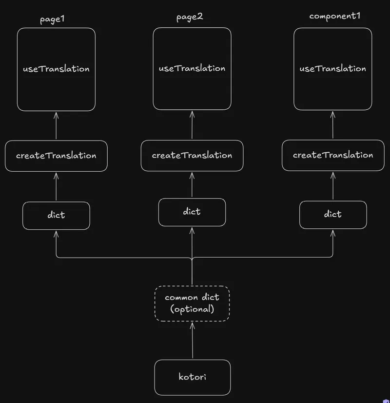

<p align="center">
  
</p>

<p align="center">
  <a href="https://www.npmjs.com/package/kotori"></a>
  <a href="https://codecov.io/gh/tylim88/Kotori"></a>
  
  <a href="https://github.com/tylim88/Kotori/blob/main/LICENSE"></a>
  
</p>

<p align="center">
🕊️ Kotori is a zero-config, fully type-safe, and modular internationalization library for React that compiles down to just 0.28kB. No JSON, no external CLI tools, no codegen—just live type inference from your strings.
</p>

```ts
const { dict, t } = kotori({
    primaryLanguageTag: 'en',
    secondaryLanguageTags: ['zh', 'ja', 'ms'],
})

// ❌ TypeScript error: missing japanese translation
const intro = dict({ 
    // ⭐ base string drives the type contract
    en: 'Hello {{name}}, is it {{time}} now?', 

     // ❌ TypeScript error: missing key 'name' 
    zh: '你好，现在是 {{time}} 吗？',

    // ❌ TypeScript error: unknown key 'nam'      
    ms: 'Hai {{nam}}, adakah pukul {{time}} sekarang?'  

// optional: type your arguments, by default it's `Record<'name'|'time', string | number>` in this example
})<{name: string; time: `${number}:${number}`}> 


// ✅ Works
t(intro, { name: 'John', time: '12:25' }) 

// ❌ TypeScript error: missing { name }
t(intro, { time: '12:25' })

// ❌ TypeScript error: unknown key 'nama'                   
t(intro, { nama: 'John', time: '12:25' }) 

// ❌ TypeScript error: invalid format for 'time'
t(intro, { name: 'John', time: '12-00' }) 
```

- No codegen
- No JSON
- No dependencies
- No build step
- 0.28kB minified and gzipped
- Modular and tree-shakeable
- Language change in one page rerenders all pages
- Variables typed and inferred from string literals — no more string typos
- maximum type safety with minimum types

Demo: <https://stackblitz.com/edit/vitejs-vite-nyxwmhre?file=src%2FApp.tsx>

## Installation

```bash
npm i kotori
```

## Quick Start

### locales.ts

```ts
import { kotori } from 'kotori'

export const { useT, dict, setLanguage, t } = kotori({
    primaryLanguageTag: 'en',
    secondaryLanguageTags: ['zh', 'ja', 'ms'],
})

// you can define your dicts in the same file or separate them by component, it's up to you
export const intro = dict({
    en: 'my name is {{name}}, I am {{age}} years old.',
    zh: '我叫{{name}}，我今年{{age}}岁了。',
    ja: '私の名前は{{name}}で、{{age}}歳です。',
    ms: 'nama saya {{name}}, saya berumur {{age}} tahun.',
})

export const time = dict({
    en: 'time {{time}}',
    zh: '时间 {{time}}',
    ja: '時間 {{time}}',
    ms: 'waktu {{time}}',
// optional: type your arguments, by default it's `Record<'time', string | number>` in this example
})<{ time: `${number}:${number}:${number}` }> 
```

### page1.tsx

```tsx
import { useT, dict, setLanguage, t, intro, time } from './locales'

export const Page1 = () => {

    const language  = useT()

    return (
        <>
            <select
                name="language"
                value={language}
                onChange={(e) => setLanguage(e.target.value as 'en')}
            >
                <option value="en">English</option>
                <option value="zh">Chinese</option>
                <option value="ja">Japanese</option>
                <option value="ms">Malay</option>
            </select>
            <p>{t(intro, { name: 'John', age: 30 })}</p>
            <p>{t(time, { time: '12:00:00' })}</p>
        </>
    )
}
```

### page2.tsx

```tsx
import { useT, dict, setLanguage, t, } from './locales'

// you can also define dicts in the same file as your components, it's up to you
const weather = dict({
    en: 'The weather in {{city}} has {{humidity}}% humidity.',
    zh: '{{city}}的天气湿度为{{humidity}}%。',
    ja: '{{city}}の湿度は{{humidity}}%です。',
    ms: 'Cuaca di {{city}} mempunyai kelembapan {{humidity}}%.',
})<{ city: string; humidity: number }>

const lastLogin = dict({
    en: 'Last login: {{date}} at {{time}}',
    zh: '上次登录：{{date}} {{time}}',
    ja: '最終ログイン：{{date}} {{time}}',
    ms: 'Log masuk terakhir: {{date}} pada {{time}}',
})<{ date: `${number}-${number}-${number}`; time: `${number}:${number}` }>

export const Page2 = () => {

    useT()

    return (
        <>
            <p>{t(weather, { city: 'Kuala Lumpur', humidity: 80 })}</p>
            <p>{t(lastLogin, { date: '2024-04-24', time: '09:30' })}</p>
        </>
    )
}
```

## API

 

### `kotori(options)`

Creates a scoped i18n instance.

```ts
import { kotori } from 'kotori'

export const { useT, dict, setLanguage } = kotori({
    primaryLanguageTag: 'en',
    secondaryLanguageTags: ['zh', 'ja', 'ms'],
})
```

| option | type | description |
| --- | --- | --- |
| `primaryLanguageTag` | `BCP47LanguageTag` | The source language. Drives variable inference. |
| `secondaryLanguageTags` | `BCP47LanguageTag[]` | Additional supported languages. |

Returns `{ dict, useT, setLanguage, t }`.

### `dict(translations)<argsType?>`

Defines a translation unit. Takes one string per language.

```ts
const time = dict({ en: '{{hour}}:{{minute}}' })
```

By default, variables are typed as `string | number`. Pass a generic to narrow them:

```ts
const time = dict({ en: '{{hour}}:{{minute}}' })<{
    hour: number
    minute: number
}>
```

### `setLanguage(tag)`

Updates the current language and rerenders all active `useT` consumers across all pages. Available directly on the `kotori` instance — useful for calling outside of React (route guards, axios interceptors, etc.).

```ts
setLanguage('zh')
```

### `t(dict, args?)` 

Returns the translated string for the current language. `args` is required if the string has variables, omitted if it doesn't. Available directly on the `kotori` instance for non-React usage.

```tsx
<p>{t(intro, { name: 'John', age: 30 })}</p>
```

### `useT()`

React hook. Returns the current language tag as a reactive value. Updates when `setLanguage` is called.

```ts
const language = useT()
```

## Language Tags

kotori uses [BCP 47](https://www.iana.org/assignments/language-subtag-registry/language-subtag-registry) language tags. Both subtags (`en`, `zh`) and full tags (`en-US`, `zh-CN`) are accepted and validated at the type level.

## Tips

- If you plan to add new languages frequently, consider colocating all your dicts in a single file. It is easier to copy the entire file and hand it to an AI to translate.
- If your supported languages are fixed, consider splitting dicts by page or component. Translations stay close to the code that uses them and are easier to maintain. This approach also pairs well with TypeScript — every time you add a new language, type errors will guide you to every dict that needs updating.
- Both approaches are tree-shakeable — only the dicts imported by the current page are included in its bundle.

## Roadmap

- Auto detect locale from browser settings
- Auto persist language selection to localStorage
- Pluralization support
- Gender support
- Value formatting (date, number, currency)
- Support for non-React frameworks (Vue, Svelte, Angular, etc.)

## Trivial

There are already a lot of i18n libraries, and the good names are mostly taken. The original plan was *kotoba* (言葉), the Japanese word for "words" — also taken. Claude suggested *kotori* as an alternative, and it stuck.

*Kotori* (小鳥) means "small bird" in Japanese. No deeper relevance to the library — it just sounds nice.
